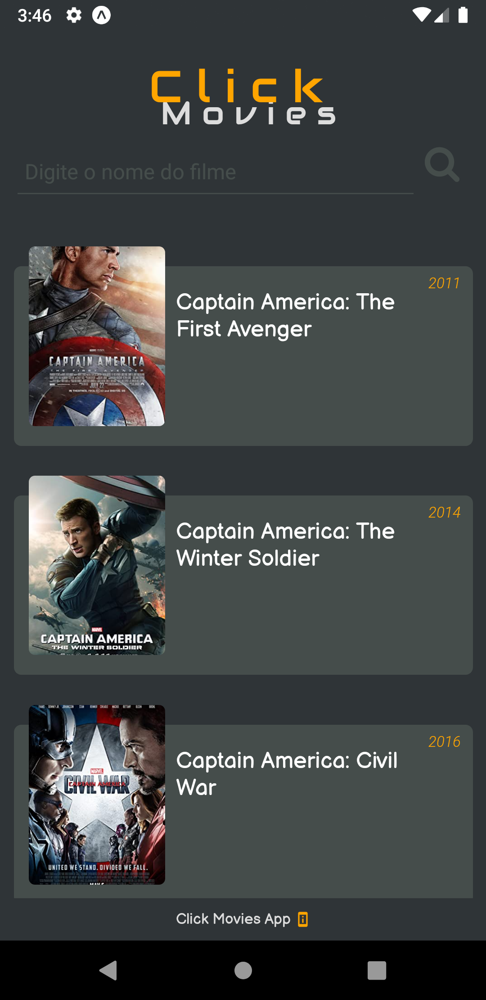
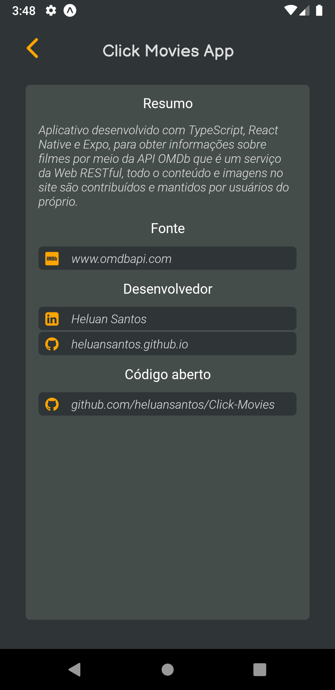

# Click-Movies App

 |  | 

Aplicativo Click Movies desenvolvido com TypeScript, React Native e Expo,
para obter informações sobre filmes por meio da API OMDb que
é um serviço da Web RESTful,todo o conteúdo e imagens no site
são contribuídos e mantidos por usuários do próprio.

# This project was developed with the following technologies:

TypeScript

React Native

Expo

# Install Mobile, Clone this repository

\$ git clone https://github.com/heluansantos/Click-Movies

# Install dependencies

\$ npm install

# Run

\$ npm start

# Expo will open, just scan the qrcode on terminal or expo page

# If some problem with fonts, execute:

\$ expo install expo-font @expo-google-fonts/audiowide @expo-google-fonts/roboto @expo-google-fonts/balsamiq-sans
